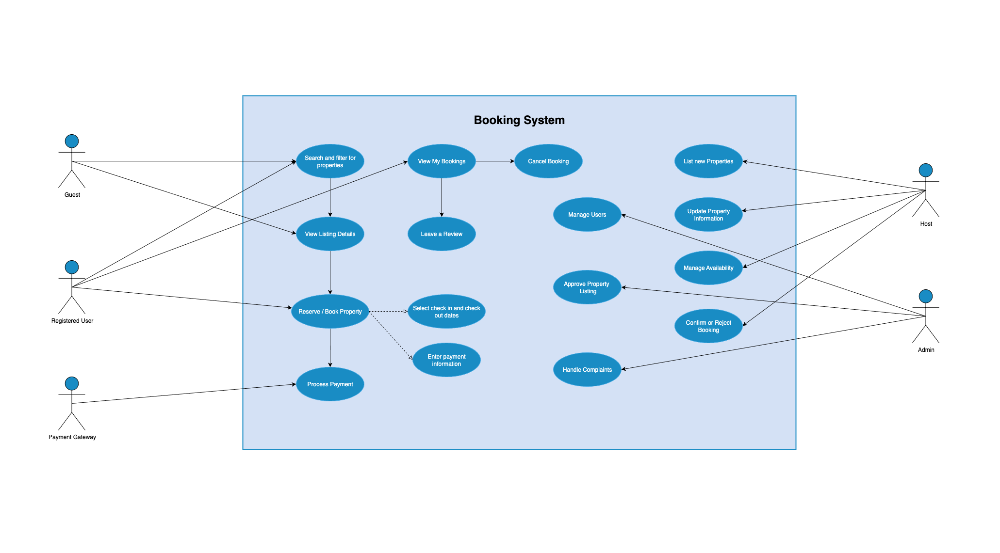

# Requirement Analysis in Software Development
The purpose of this repository is to practice requirement analysis, which focuses on crafting a comprehensive foundation for software development by documenting, analysing, and structuring requirements.

---

## What is Requirement Analysis?
Requirement analysis is a crucial phase in the software development lifecycle (SDLC) where the project team gathers, analyses, and defines the requirements of the software product to be developed.

It is the process of identifying, documenting, validating, and managing the needs and expectations of stakeholders for a software system. It involves understanding what the system should do, the constraints under which it must operate, and the features that will satisfy business objectives.

It is typically the first and most crucial phase of the software development lifecycle (SDLC), because errors or gaps at this stage can spread across the entire project, leading to wasted effort, cost overruns, or project failure.

---

## Why is Requirement Analysis Important?

- **Prevents Scope Creep:** Scope creep happens when new features or changes are added to a project without proper evaluation or approval, often leading to delays and cost overruns. Through thorough requirement analysis, all project needs are defined, agreed upon, and documented early in the process. This makes it easier to control changes, prioritise features, and ensure the project stays on track.

- **Provides a Strong Foundation for Design, Development, and Testing:** Requirement Analysis creates a clear blueprint of what the system should do and how it should behave. Without this foundation, teams risk misalignment, leading to incomplete or low-quality software.

- **Enables Accurate Cost and Time Estimation:** A well-documented set of requirements helps project managers estimate resources, effort, and timelines more precisely. If requirements are vague or incomplete, cost and time projections may be unrealistic, resulting in budget overruns or missed deadlines.

- **Ensures Clarity and Understanding:** Requirement Analysis acts as a communication bridge between stakeholders (users, business managers, and the development team). It eliminates ambiguity by translating stakeholder needs into clear, structured, and testable requirements.

---

## Key Activities in Requirement Analysis
- **Requirement Gathering:** This is the initial step in the requirement analysis process, where raw information is collected from stakeholders about what they expect from the system. At this stage, it is important to identify all relevant stakeholders such as clients, end-users, managers, and domain experts in order to understand their expectations. Different techniques are used to gather this information, including surveys, interviews, reviewing existing documents, studying current systems, and even observing end-users in their working environment. The purpose of this activity is to compile a comprehensive list of desired features, constraints, and objectives that will shape the direction of the project.

- **Requirement Elicitation:** It goes beyond simply gathering information; it focuses on drawing out detailed and precise needs from stakeholders. Since users may not always be able to articulate their requirements clearly, elicitation relies on structured techniques such as workshops, brainstorming sessions, prototyping, focus groups, use case analysis, and observation. The aim here is to uncover hidden, implicit, and critical requirements that might not surface during the basic gathering process. This ensures that the development team gains a deeper understanding of what users actually need rather than just what they initially state.

- **Requirement Documentation:** Once requirements have been gathered and elicited, they must be recorded in a structured format to serve as a reference point throughout the development process. This is usually done through a Software Requirements Specification (SRS) document, which lists both functional and non-functional requirements in detail. In addition, user stories and use cases are often created to capture system interactions and user expectations. Proper documentation ensures clarity, consistency, and eliminates ambiguity, thereby creating a single source of truth that guides the design, development, and testing of the software system.

- **Requirement Analysis and Modelling:** After documentation, the requirements need to be examined and refined to ensure they are feasible, complete, and logically structured. This involves classifying requirements such as functional, non-functional, and domain-specific, while also checking for conflicts and prioritising features. A feasibility analysis is also conducted at this stage to evaluate technical, financial, and time-related constraints. To aid understanding, modelling techniques such as use case diagrams, entity-relationship diagrams, process flows, and prototypes are often employed. The goal of this step is to transform raw requirements into a structured and analyzable format that supports clear decision-making and system design.

- **Requirement Validation:** The final activity in requirement analysis is validation, which ensures that the requirements accurately reflect stakeholder needs and are practically achievable. Validation involves techniques such as walkthroughs, peer reviews, prototyping, and obtaining formal sign-offs from stakeholders. This process checks the requirements for accuracy, completeness, consistency, and testability. The ultimate goal is to confirm that the requirements are correct, realistic, and agreed upon, making them ready to serve as the foundation for system design and development.

---

## Types of Requirements
### Functional Requirements
Functional requirements define what the system should do: its features, capabilities, and interactions. They describe the tasks, services, or functions the system must perform to meet stakeholder needs. In the context of the booking management project, functional requirements specify how users and administrators interact with the system.

Examples for the Booking Management Project:
- The system must allow users to create new bookings for available slots.
- The system should send automated booking confirmation emails or SMS to users after a successful reservation.
- Users must be able to view, update, or cancel their bookings through the platform.
- Administrators should have the ability to add, edit, or remove available time slots or services.

### Non-functional Requirements
Non-functional requirements specify the quality attributes and constraints of the system rather than specific behaviors. They describe how the system performs its functions, covering areas such as usability, performance, reliability, and security. For the booking management project, these requirements ensure the platform delivers a smooth, secure, and scalable user experience.

Examples for the Booking Management Projects:
- The system should handle up to 1,000 concurrent users without performance degradation.
- Booking confirmations must be sent within 30 seconds of successful reservation.
- User data must be protected with encryption.
- The system interface should be mobile-friendly and accessible to users with disabilities (compliant with WCAG 2.1 standards).

---

## Use Case Diagrams

Use Case Diagrams are a type of Unified Modelling Language (UML) diagram that serves as a visual representation of the functional interactions between users/actors and a system. They illustrate what the system should do, and which users or external systems interact with those functionalities.

### Benefits of Use Case Diagrams
- **Clarity in Communication:** They provide a simple, high-level view of system functionality that both technical and non-technical stakeholders can understand.
- **Requirement Validation:** Help verify that all user needs have been captured and linked to system functions.
- **System Boundaries:** Clearly define what is inside the system (use cases) and what is external (actors).

### Use Case Diagram for Booking System

